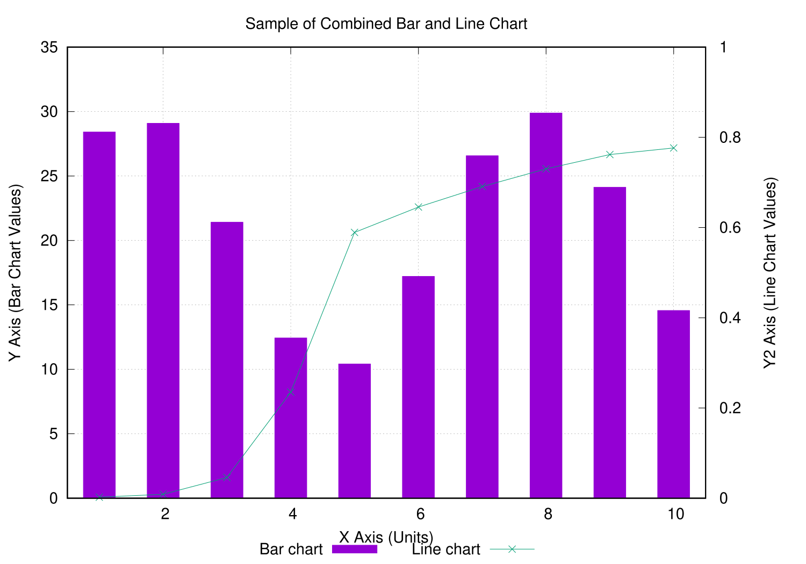
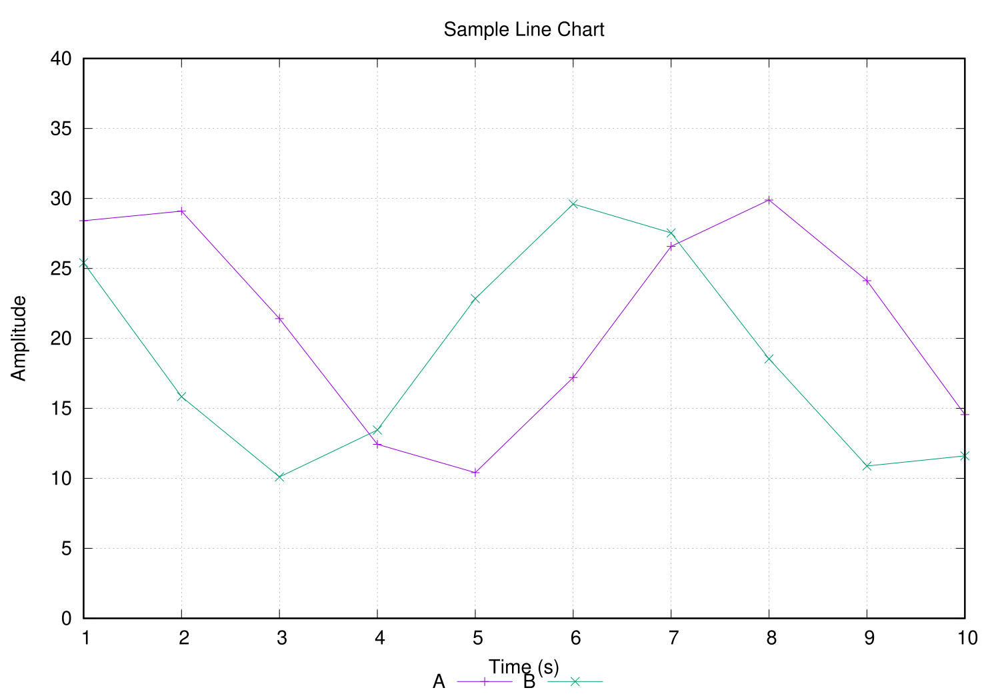

# VSCodeを用いたgnuplot活用法

綺麗な図を出したいけどgnuplotアプリケーションの使い方がよくわからない人向けのセットアップ備忘録。

Windowsでの使用を前提としています。Macでも使えるはずですが、未確認なので頑張ってください。

[こちらの記事](https://otepipi.hatenablog.com/entry/2019/04/09/214829)を参考にしています。

## Install Guide

### 1. gnuplotをインストールする

[gnuplot download](http://www.gnuplot.info/download.html)から[Primary download site on SourceForge](https://sourceforge.net/projects/gnuplot/files/gnuplot/)にアクセスして、好きなバージョンのgnuplotをダウンロードする。

よくわからない場合は`Download Latest Version`を選択すれば勝手にダウンロードが始まる。

ダウンロードしたインストーラー(`gp548-win64-mingw.exe`みたいなやつ)を実行して、インストールを行う。適当にポチポチしていればそのうちインストールされる。

> [!IMPORTANT]
> `追加タスクの選択`の時に、`一番下の実行ファイルのディレクトリをPATH環境変数に追加する`にチェックが入っていること確認すること。

### 2. VSCodeをインストールする

[Download Visual Studio Code](https://code.visualstudio.com/download)にアクセスして、自分の環境にあったインストーラーをダウンロードし、実行してインストールを行う。

### 3. Markdown Preview Enhancedをインストールする

VSCodeの拡張機能、Markdown Preview Enhancedをインストールする。Markdownで数式や図が表示できるようになる。

1. VSCodeを開いて、左側のアクティビティバーから拡張機能(`ctrl`+`shift`+`x`)を選択
2. 検索ボックスにMarkdown Preview Enhancedを入れて検索、該当拡張機能をインストール
3. 左側の歯車マークから、設定(`ctrl`+`,`)を開く
4. 設定の検索にMarkdown Preview Enhancedを入力
5. `Markdown-preview-enhanced: Enable Script Execiton`にチェックを入れる

これで使えるようになるはず

## Usage

1. markdownファイルをクリックして、右上の眼鏡マークからプレビュー(`ctrl`+`k`, `v`)を表示させる
2. markdownファイルの任意の場所をクリックしてアクティブにして、`ctrl`+`shift`+`enter`を入力してScriptを実行させる

  
  
  
  

こんな感じのグラフがサクッと作れるよ！

え？gnuplotスクリプトの書き方がわからない？webで調べるかChatGPTに聞いてね！